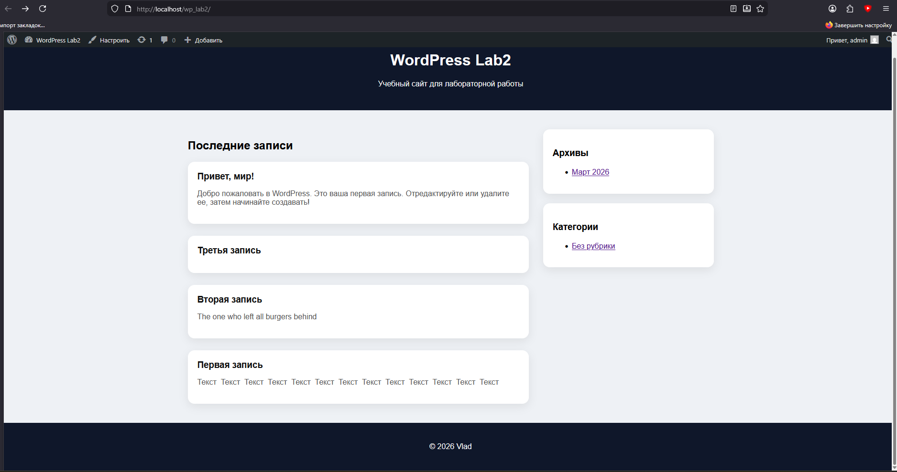

# Лабораторная работа №3

## Разработка простой темы WordPress

**Студент:** Чертков Владислав
**Группа:** IA2303
**Дисциплина:** Content Management Systems

---

# Описание работы

Целью лабораторной работы является изучение процесса создания пользовательской темы WordPress, понимание минимальной структуры темы и принципов работы шаблонов.

В ходе выполнения работы была разработана собственная тема WordPress с базовой структурой, подключением стилей и выводом контента.

---

# Инструкция по запуску проекта

1. Установить XAMPP (или аналогичный сервер)
2. Запустить **Apache** и **MySQL**
3. Открыть браузер и перейти:

```
http://localhost/wp_lab2
```

4. Скопировать папку темы в:

```
wp-content/themes/
```

5. Перейти в админ-панель WordPress:

```
http://localhost/wp_lab2/wp-admin
```

6. Активировать тему:
   **Appearance (Внешний вид) → Themes (Темы)**

---

# Структура темы

В процессе работы была создана тема **usm-theme**, содержащая следующие файлы:

* style.css
* index.php
* header.php
* footer.php
* functions.php
* single.php
* page.php
* sidebar.php
* comments.php
* archive.php
* screenshot.png

---

# 🛠️ Реализация

## 1. Подготовка среды

* Использована локальная установка WordPress
* Создана папка темы в `wp-content/themes`
* Включён режим отладки (`WP_DEBUG`)

---

## 2. Базовые файлы темы

Созданы обязательные файлы:

* **style.css** — содержит метаданные темы и стили
* **index.php** — основной шаблон

---

## 3. Общие части шаблона

* Созданы файлы **header.php** и **footer.php**
* Подключение выполнено через:

```
get_header();
get_footer();
```

---

## 4. Вывод записей

На главной странице реализован вывод записей с помощью цикла WordPress:

```
have_posts()
the_post()
the_title()
the_content()
```

---

## 5. Файл functions.php

Реализовано подключение стилей:

```
wp_enqueue_style()
```

Также добавлена поддержка изображений записей:

```
add_theme_support('post-thumbnails');
```

---

## 6. Дополнительные шаблоны

Созданы:

* **single.php** — отображение одной записи
* **page.php** — отображение страниц
* **sidebar.php** — боковая панель
* **comments.php** — комментарии
* **archive.php** — архивы

---

## 7. Стилизация

Добавлены стили для:

* шапки сайта
* контента
* карточек записей
* боковой панели
* футера

Реализован современный внешний вид с использованием CSS (карточки, тени, сетка).

---

## 8. Скриншот темы

Добавлен файл:

```
screenshot.png
```

Используется как превью темы в WordPress.

---

# Пример использования

После активации темы:

* отображаются записи в виде карточек
* работает боковая панель (архивы и категории)
* корректно отображаются изображения записей
* реализован современный блоговый дизайн



---

# Ответы на контрольные вопросы

### 1. Какие два файла обязательны для темы WordPress?

Обязательные файлы:

* style.css
* index.php

---

### 2. Как подключаются общие части шаблонов?

С помощью функций:

* get_header()
* get_footer()
* get_sidebar()

---

### 3. Разница между index.php, single.php и page.php

* **index.php** — основной шаблон (главная страница и fallback)
* **single.php** — отображение одной записи
* **page.php** — отображение страниц

---

### 4. Роль файла functions.php

Файл functions.php используется для:

* подключения стилей и скриптов
* добавления функциональности темы
* включения поддержки возможностей WordPress

---

# Использованные источники

* https://wordpress.org
* https://developer.wordpress.org
* Учебные материалы курса

---

# Вывод

В ходе лабораторной работы была успешно разработана собственная тема WordPress. Были изучены основные принципы работы шаблонов, структура темы и способы подключения стилей. Также был реализован пользовательский дизайн сайта и вывод контента.
